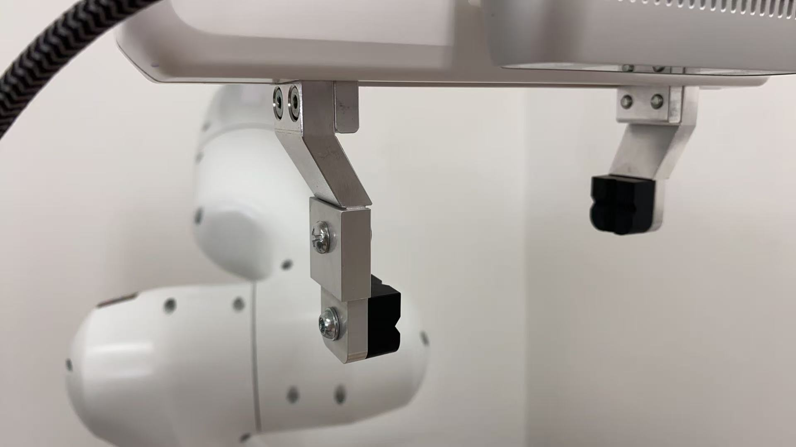
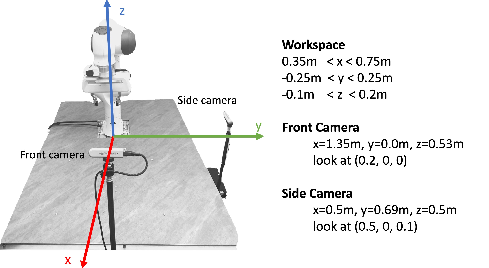
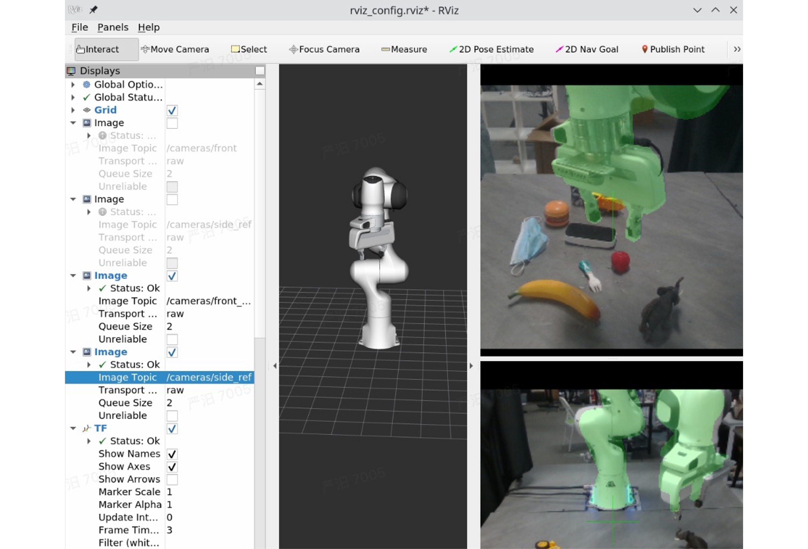

# Real World Controller for GraspVLA
This repository contains the client code used to control a Franka robot in the real world for [GraspVLA](https://github.com/PKU-EPIC/GraspVLA). 
- Model server code is available [here](https://github.com/PKU-EPIC/GraspVLA).
- Simulation evaluation code is available [here](https://github.com/MiYanDoris/GraspVLA-playground).


## Hardware Requirements
- **Robot**: A Franka robot. The default Dockerfile supports the latest Franka Research 3. For earlier FER3 versions, use Dockerfile_FER3.
- **Cameras**: Two RGB cameras. We support Intel RealSense D435 and D415i. Any RGB camera with field of view >43° (horizontal and vertical) should work, but requires code modifications.
- **Workstation**: Tested on Ubuntu 20.04. If you use remote server to run the model, GPU is not required on this workstation.


## Installation
We strongly recommend using docker. For Docker installation instructions, see https://docs.docker.com/engine/install/.

### Build
```
docker build . -t graspvla_franka_ros:latest
```

## Configuration
### Franka

- **IP**. Modify the `FRANKA_IP` in `demo.env` to your franka desk ip.

    Make sure your workstation ip and franka desk ip are in the same network (e.g., workstation ip = 172.16.0.1 and franka desk ip = 172.16.0.2). For details, see https://frankarobotics.github.io/docs/getting_started.html#setting-up-the-network.

- **FCI Mode**. Visit franka desk in web browser, for example https://172.16.0.2/desk. In top right of the panel, click the `enable fci interface` button. For details, see https://frankarobotics.github.io/docs/getting_started.html#preparing-the-robot-for-fci-usage-in-desk.

- **Extention of Fingers**. To grasp convex-shaped objects more firmly, we extend the original Franka fingers as shown in the figure below. However, our model works robustly with both the original and extended fingers, so you can choose either option based on your needs.

    - To use extensions: Print two copies of `res/extension.STEP` and install them.

    - To use the original fingers: Remove the `--extended_finger` flag in `docker-compose.yml` (this adjusts proprioception accordingly).



### Camera
- **Serial Number**. Modify the `FRONT_CAMERA_SERIAL_NUMBER` and `SIDE_CAMERA_SERIAL_NUMBER` in `demo.env` to your camera serial numbers.

    You can find the serial numbers of your Realsense cameras in the RealSense Viewer tool by clicking the 'Info' option at the top of the Viewer's options side-panel.



- **Calibration (Rough)**. Since we randomize the camera extrinsics in our dataset, you only need to roughly align your camera setup with the image above. The definition of the robot coordinate system and the camera transformations are shown in the figure.

  - **Step 1**: Use a tape measure to roughly position the two cameras.

  - **Step 2**: Run `xhost + && source demo.env && docker compose run calibrate_camera` to adjust rotation. ⚠️ Note that, the end effector will move to z=0.2m—ensure the table is lower than that to avoid collisions. Once the arm stops moving, align the green reference mask in RViz (front_ref/side_ref) with the actual images and check that the cameras are level (table edges should appear roughly horizontal). We provide our own reference images below for reference.
    



### Connection to the Model Server
Start the model server following the instructions in [GraspVLA](https://github.com/PKU-EPIC/GraspVLA) and modify the `SERVER_IP` and `SERVER_PORT` in `demo.env` to your server ip and port. If you use remote server, you can set them to be its public address. If you start the server on the same machine as the client, you can set them to be 127.0.0.1 and 6666.

You can run the following command to validate the server is running. It will return ✓ if the server returns a valid dict.
```
source demo.env
python3 validate_server.py
```

## Inference
To start inference, run the following commands:
```
xhost +
source demo.env
docker compose run main
```

### Usage Tips
  - Start with simple cases (e.g., a single banana on a table) to test the pipeline

  - When prompted, just type the object name. It will auto-complete to "pick up (object name)".

  - Controls: 
  
    - `p` - pause the robot
    
    - `q` - finish trajectory and reset to initial pose (opens gripper)

### Output Indicators:
- `observation sent...` - Observation sent to server

- `response received, cost xxx.xxs` - Response received

- Gripper actions and delta translations are printed in console

### Safety Features:
- To avoid objects from falling when opening the gripper (q), enable automatic lowering by adding `--automatically_put_down` flag to `docker-compose.yml`. It will move down the gripper by 10cm before opening the gripper to prevent the object from falling and breaking.

- When the robot receives an external force larger than FORCE_LIMIT (default 15N), it will print `large external force or robot abnormal, trying to recover...` and lift by 5cm to avoid collision.


## Citation

If you found this repository useful, please consider to cite the following works:

- Our paper:
```bibtex
@article{deng2025graspvla,
    title={GraspVLA: a Grasping Foundation Model Pre-trained on Billion-scale Synthetic Action Data}, 
    author={Shengliang Deng and Mi Yan and Songlin Wei and Haixin Ma and Yuxin Yang and Jiayi Chen and Zhiqi Zhang and Taoyu Yang and Xuheng Zhang and Wenhao Zhang and Heming Cui and Zhizheng Zhang and He Wang},
    year={2025},
    eprint={2505.03233},
    archivePrefix={arXiv},
    primaryClass={cs.RO},
    url={https://arxiv.org/abs/2505.03233}
}
```

- Control Suite:
```bibtex
@misc{luo2025serlsoftwaresuitesampleefficient,
      title={SERL: A Software Suite for Sample-Efficient Robotic Reinforcement Learning}, 
      author={Jianlan Luo and Zheyuan Hu and Charles Xu and You Liang Tan and Jacob Berg and Archit Sharma and Stefan Schaal and Chelsea Finn and Abhishek Gupta and Sergey Levine},
      year={2025},
      eprint={2401.16013},
      archivePrefix={arXiv},
      primaryClass={cs.RO},
      url={https://arxiv.org/abs/2401.16013}, 
}
```